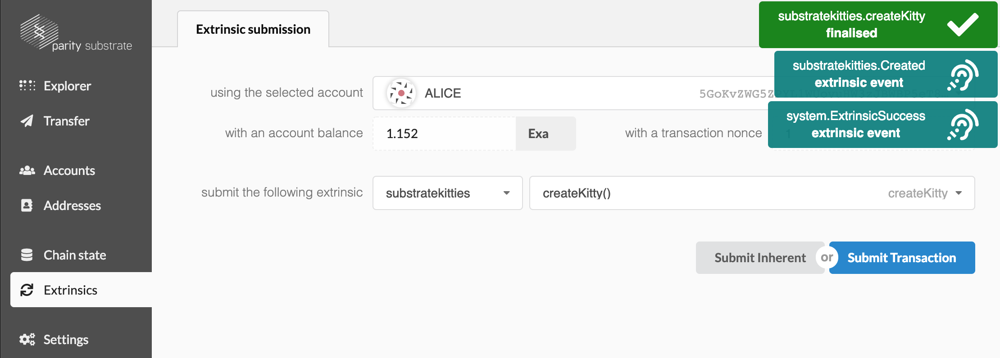
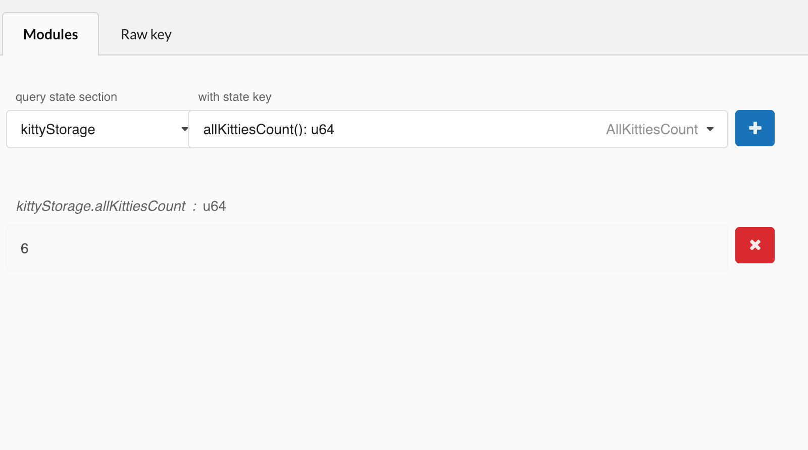

Viewing Multiple Kitties
===

We added a lot of items to our runtime storage since we last played around with the Polkadot UI, not to mention that our storage structure is also a bit more complex. Now is a good opportunity to take a look at what we have done so far, and check out how we can navigate through the kitties being generated in our runtime.

Remember to start a clean version of your chain before jumping into the UI:

```
./build.sh
cargo build --release
./target/release/substratekitties purge-chain --dev
./target/release/substratekitties --dev
```

## Funding and Using Multiple Accounts

The first thing you want to do is transfer funds from Alice to a few of the provided accounts. Let's send funds to both Bob and Charlie.

Now we will go into the **Extrinsics** tab, where we will select our `create_kitty()` function in the UI:

```
substratekitties > createKitty()
```

For our test we will have Alice create 3 kitties, Bob create 2 kitties, and Charlie create 1.



## Viewing Our Storage

Now we can explore all the storage items we set up an make sure things are working correctly.

First we should check the total number of kitties in our system:

```
kittyStorage > allKittiesCount(): u64
```

If all went right, we should get the value `6` returned.



Next we should check the kitty count for each user:
