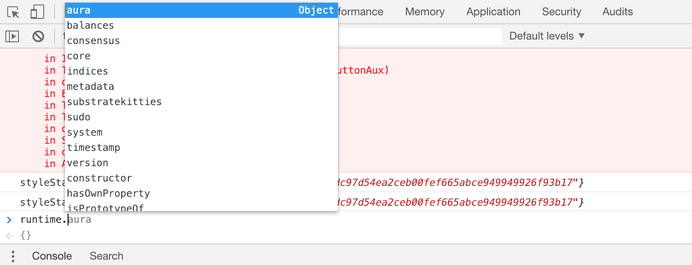
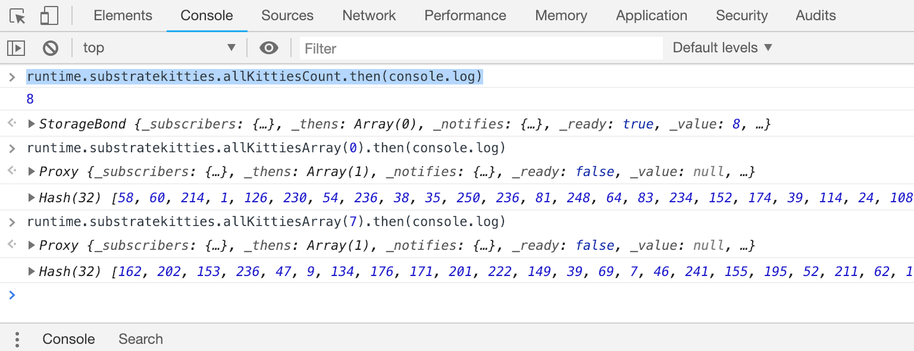

Explore the Substrate UI
===

The Substrate UI has a lot going on inside. We will try to simplify some of the concepts and enable you to start customizing your UI.

## Bare Bones Substrate UI

The `substrate-ui` template comes with a number of prebuilt features that you might expect for the average Blockchain UI.

- A wallet to manage and create keys + accounts
- An address book to get details about accounts
- A transfer function to send funds between accounts
- A runtime upgrade UX to make easy updates to your runtime

## Runtime Upgrade

Up until now, we have had you "purge" your chain and generate new binaries every time you wanted to make changes to your runtime. However, Substrate is unique in that it allows for "forkless upgrades" where you are able to upgrade your runtime logic without having to cause problems to your network.

You might try this if you make logical changes to some of your functions as suggested in the challenges at the end of chapter 3. Take a look [here](https://substrate.readme.io/docs/creating-a-custom-substrate-chain#section-step-5-upgrade-our-chain) for some more details.

## React Components

If you peak into the Substrate UI code, you will see that it is made up of React Components each which serve their own purpose. As mentioned, the Substrate UI comes with a set of prebuilt features, and you can find the components which power those features in the `src` folder.

All of these components are put together in the `src/app.jsx` file which powers the main view that you see.

## Reading Our Runtime

You can see that the Substrate UI has access to our blockchain. More impressively is that it is already aware of the new module you created, along with the features and functionalities you added to that module. Let's explore some of the ways you can poke around and explore your module from the perspective of the Substrate UI.

For this we will be working in your browser's console and using the autocomplete while the Substrate UI is open and running. This is usually accessible by pressing `F12`, or going into `Inspect Element` mode.

If we go into the console and type (note the dot at the end):
```
runtime.
```

We should see a list of autocomplete options that our browser is aware of:



You might notice that these are our modules! Better yet, we can see `susbtratekitties`. Let's go deeper:

```
runtime.substratekitties.
```


Here we can see all of the storage items our module exposes. Let's read from one of them:



```javascript
> runtime.substratekitties.allKittiesCount.then(console.log)

8

> runtime.substratekitties.allKittiesArray(0).then(console.log)

Hash(32) [58, 60, 214, 1, 126, 230, 54, 236, 38, 35, 250, 236, 81, 248, 64, 83, 234, 152, 174, 39, 114, 24, 108, 34, 128, 61, 74, 136, 74, 38, 206, 48]

> runtime.substratekitties.allKittiesArray(7).then(console.log)

Hash(32) [162, 202, 153, 236, 47, 9, 134, 176, 171, 201, 222, 149, 39, 69, 7, 46, 241, 155, 195, 52, 211, 62, 170, 24, 130, 50, 252, 36, 126, 209, 153, 38]
```

You can see that this example runtime has 8 kitties, all of which you can access from the `allKittiesArray`.

## Using Runtime Variables in Substrate UI

We can start off simple and try to update the Substrate UI to include a live kitty count on the page.

The variables we showed above are Bonds, which means their values will update automatically as changes to your blockchain happen. However, that also means that you need to work with these variables a little differently than normal (note that we used promises in the example above).

Fortunately, for our example, we will use some of the components already built for us. In this case we will use an aptly named component called `Pretty` which turns most any bond into a readable string. You can see it being used on other parts of the page.

In our example blockchain:

```
<Pretty value={runtime.substratekitties.allKittiesCount}/>
```

Would convert to:

```
<span>8</span>
```

Additionally, as the value for `allKittiesCount` changes, our HTML will automatically update to represent the latest value. This is thanks to React states which automatically re-render the contents of the component.

## Your Turn!

In the template, we currently have a `Subheader` which says:

```javascript
<Header.Subheader>There are 0 kitties purring.</Header.Subheader>
```

Update the `0` value to represent the current number of kitties tracked in our runtime. Then add some kitties using the Polkadot UI and confirm the value is automatically updated.

[embedded-code](./assets/4.2-template.js ':include :type=code embed-template')

<a href="javascript:toggleHint()" id="hint_link">Reveal the solution...</a>

[embedded-code-final](./assets/4.2-finished-code.js ':include :type=code embed-final')