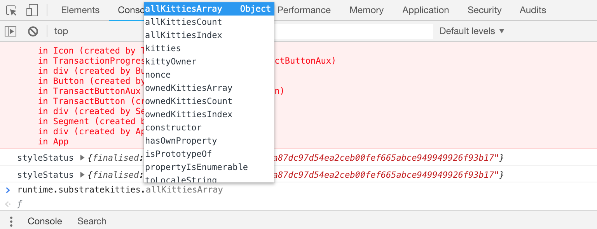

# Explore the Substrate UI

The Substrate UI has a lot going on inside. We will try to simplify some of the concepts and enable you to start customizing your UI.

## Bare Bones Substrate UI

The `substrate-ui` template comes with a number of prebuilt features that you might expect for the average Blockchain UI.

- A wallet to manage and create keys + accounts
- An address book to get details about accounts
- A transfer function to send funds between accounts
- A runtime upgrade UX to make easy updates to your runtime

## Runtime Upgrade

Up until now, we have had you "purge" your chain and generate new binaries every time you wanted to make changes to your runtime. However, Substrate is unique in that it allows for "forkless upgrades" where you are able to upgrade your runtime logic without having to cause problems to your network.

You might try this if you make logical changes to some of your functions as suggested in the challenges at the end of chapter 3. Take a look [here](https://substrate.readme.io/docs/creating-a-custom-substrate-chain#section-step-5-upgrade-our-chain) for some more details.

## React Components

If you peak into the Substrate UI code, you will see that it is made up of React Components each which serve their own purpose. As mentioned, the Substrate UI comes with a set of prebuilt features, and you can find the components which power those features in the `src` folder.

All of these components are put together in the `src/app.jsx` file which powers the main view that you see.

## Accessing Our Blockchain

You can see that the Substrate UI has access to our blockchain. More impressively is that it is already aware of the new module you created, along with the features and functionalities you added to that module. Let's explore some of the ways you can poke around and explore your module from the perspective of the Substrate UI.

For this we will be working in your browser's console and using the autocomplete. This is usually accessible by pressing `F12`, or going into `Inspect Element` mode.

### Accessing our Runtime

If we go into the console and type `runtime.` (note the dot at the end), we should see a list of autocomplete options that our browser is aware of:

You might notice that these are our modules! Better yet, we can see `susbtratekitties`. Let's go deeper.

Here we can see all of the storage items our module exposes. Let's read from one of them:

