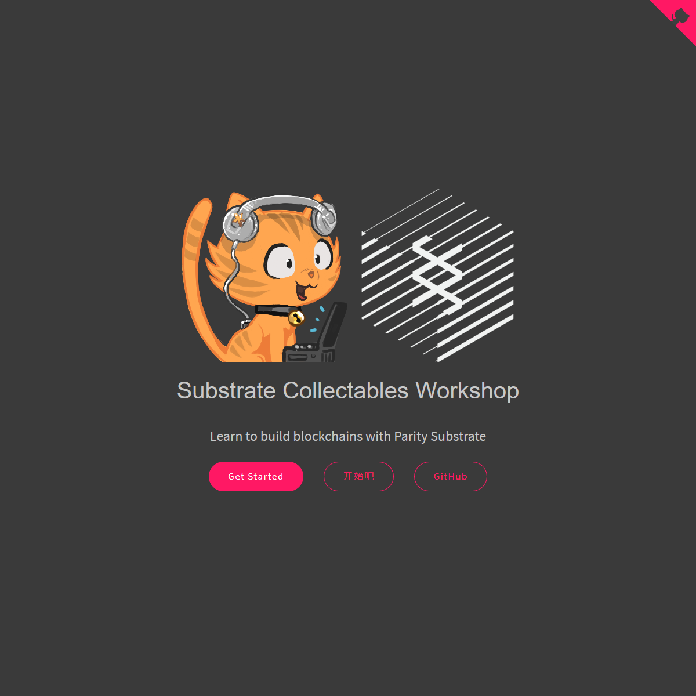

# Substrate Collectables Workshop

This repository is the basis for a tutorial teaching how to develop a simple NFT marketplace using the [`polkadot-sdk`](https://github.com/paritytech/polkadot-sdk).



## Goal

The goal of this tutorial is to **teach by experience** various entry level concepts around Polkadot Pallet development.

The tutorial is designed to be completed by anyone with basic familiarity with Rust, and little to no familiarity with the Polkadot SDK.

If you do not feel comfortable with the level of Rust used in this tutorial, we recommend you first check out the [`rust-state-machine`](https://github.com/shawntabrizi/rust-state-machine) tutorial.

## How To Use

This repository is not meant to be used directly, but as the source for generating an interactive tutorial using the source code and readme files included at each commit.

This repository manages 3 branches, each with its own history and purpose:

- [`master`](https://github.com/shawntabrizi/substrate-collectables-workshop/): This is an expanded version of each step and file of the tutorial. Each step has its own full source code and README which is used for that step in the tutorial.
- [`gitorial`](https://github.com/shawntabrizi/substrate-collectables-workshop/tree/gitorial): This branch repackages all the steps of the tutorial into a single Git history. You can actually take a [look at the history](https://github.com/shawntabrizi/substrate-collectables-workshop/commits/gitorial/) of the `gitorial` branch, and see how each steps evolves using the Git diff.
- `mdbook`: This is a special repackaging of the tutorial for generating an [mdBook](https://github.com/rust-lang/mdBook) that can be directly used by students.

If you have small changes that need to be made to a single step, feel free to open an issue or make a PR against the `master` branch. However, for more complex changes which may affect multiple steps, consider learning more about the `gitorial` format.

### More about Gitorial

The heart of this tutorial is the [Gitorial format](https://github.com/gitorial-sdk).

If you browse the [commit history](https://github.com/shawntabrizi/substrate-collectables-workshop/commits/gitorial/) of the `gitorial` branch, you will see that each commit is designed to be a single step in the tutorial.

All commits are prefixed with one of:

- `section`: This denotes the beginning of a new set of steps which will have a specific goal. These commits will only have changes to the `README.md` file which can be used to introduce the new section of the tutorial.
- `template`: This is the commit has a `README.md` that teaches the reader any information needed to complete the step. It will also include files with `TODO` comments, telling the user what specifically needs to be done. A `template` will always be followed by a `solution`.
- `solution`: These commits will always come after a `template` commit. These commits will have the final state of all files in the project at the end of a step. Commits prefixed with `solution` should always compile, run and test successfully (compiler warning are okay). The `template` and `solution` commits should be presented together so reads can compare their work to a working solution. These commits can also be used to generate a `diff` of the step. The `README.md` file in this commit does not need to be presented to the user.
- `action`: This denotes a step in the tutorial where the user needs to complete some action, not necessarily write any code. For example, the user might need to import a new crate. In this case, it does not make sense to have a `template` and `solution`, but just the final outcome after the action was taken. The previous commit can be used for generating a `diff`. The `README.md` file should contain any information the user needs to complete the action successfully.
- `readme`: This is only applied to the last commit in this repo, and denotes that this commit was specifically for make a `README.md` for users that browse this repository on github. This step should not be used in the tutorial generation.

You can use Git to make changes to the history of the repo, and then use `git merge` to propagate those changes cleanly into the rest of your repo.

## Maintenance

Maintaining the repo means keeping all three of the main branches in sync.

For this, you can use the [`gitorial-cli`](https://github.com/gitorial-sdk/cli).

Once you have made changes to the appropriate branch, you can use these commands to get all branches in order:

- Convert `master` to an up to date `gitorial` branch:

    ```sh
	gitorial-cli repack -p /path/to/substrate-collectables-workshop -i master -s steps -o gitorial2
	```

	Then check your work, and `git reset --hard` the `gitorial` branch with `gitorial2`.

- Convert `gitorial` to an up to date `mdbook` branch:

	```sh
	gitorial-cli mdbook -p /path/to/substrate-collectables-workshop -i gitorial -o mdbook
	```

- Convert `gitorial` to an up to date `master` branch:

	```sh
	gitorial-cli unpack -p /path/to/substrate-collectables-workshop -i gitorial -o master -s steps
	```
