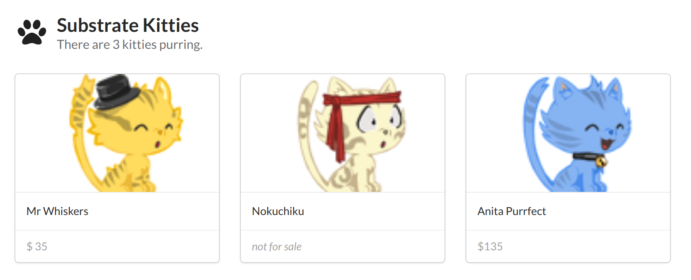

# [Substrate Collectables][main link]
> The interactive hands-on build-your-first-blockchain with [substrate][] workshop

## What this is

This is an interactive hands-on self-paced workshop. You will learn how to build your first blockchain using [substrate][], the OpenSource [Rust][] Blockchain Development Kit by [parity][]. Through the lessons of the workshop, you will built a collectables blockchain -- a chain creating assets, allow to interact with and managing ownership of them.

As such, this material will focus on the logic of building said chain. It won't cover the networking, consensus or economic incentive aspects of blockchains. Fortunately, substrate comes with decent networking and consensus engines built in and we can focus on the chain logic.

Substrate is built using [Rust][], a modern statically typed systems programming language. We won't go into the details of the language within this workshop. The language is quite easy to read and follow and if you have programmed before, you shouldn't have too much trouble following what is going on and finish the exercises even if [Rust][] is new to you.

## How to do it

Just go through the material chapter by chapter, do one exercise at a time. While the material is meant for you to be able to do on your own, we highly recommend to get together and work on it with others, in learning groups or hosted workshops. It is totally normal that one might get stuck from time to time or don't understand what the material attempt to explain and in those situations it helps a lot to have other around to talk about it and resolve that frustration. That said, we highly appreciate any [feedback regarding the material, and where you might got stuck][feedback].

# [Let's go](/0/0.0-introduction.md)

---
**NOTE**

Substrate is a rapidly evolving project, which means that breaking changes may cause you problems when trying to follow these instructions. Feel free to [contact us](https://substrate.readme.io/v1.0.0/docs/feedback) with any problems you encounter.

---

[main link]: https://shawntabrizi.github.io/substrate-collectables-workshop/
[feedback]: https://substrate.readme.io/v1.0.0/docs/feedback
[substrate]: https://www.parity.io/substrate/
[substrate docs]: https://substrate.readme.io/
[parity]: https://www.parity.io/
[Rust]: https://www.rust-lang.org/
