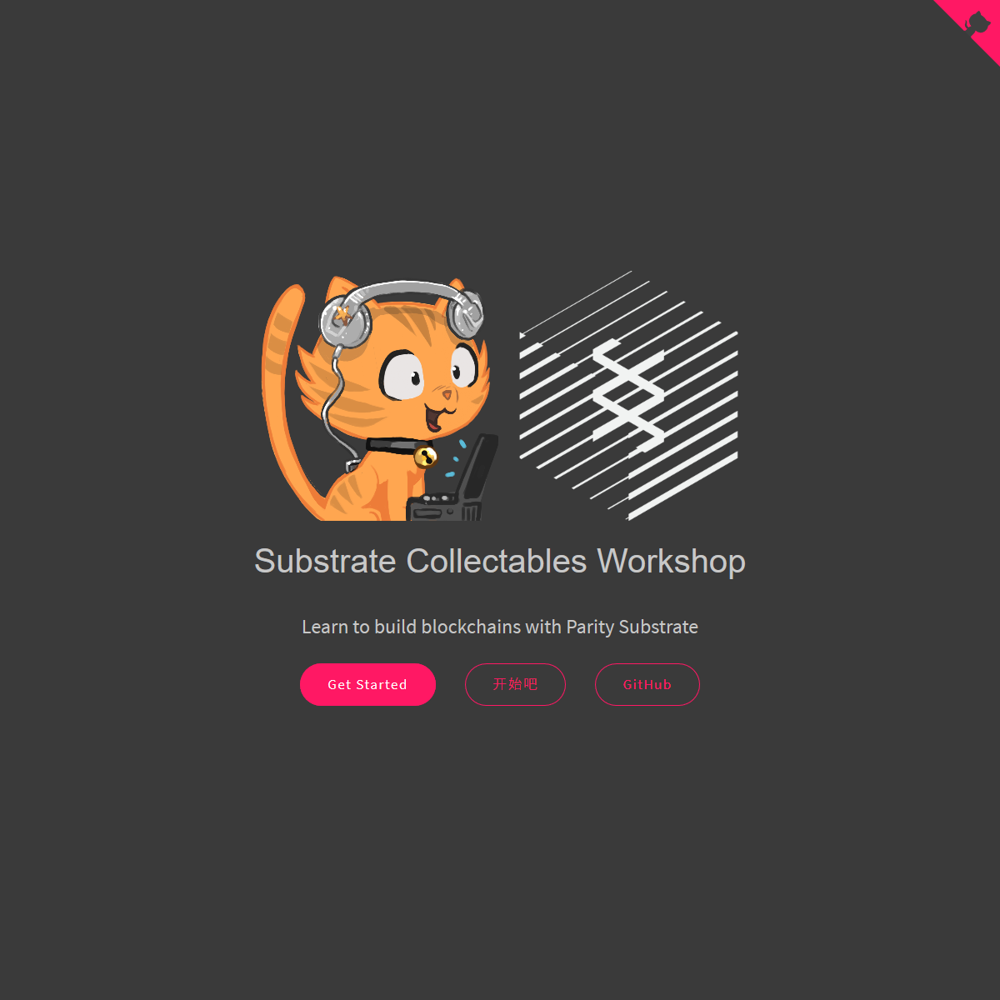

# Substrate Collectables Workshop

A guided, hands-on tutorial for building a simple NFT marketplace pallet with the [Polkadot SDK](https://github.com/paritytech/polkadot-sdk).

## Read the Tutorial

The tutorial is published as an interactive book:

**👉 https://www.shawntabrizi.com/substrate-collectables-workshop/**

That is the recommended way to follow along. This repository is the source.

## Goal

Teach entry-level Polkadot pallet development **by experience**. By the end you will have written a custom pallet that mints, transfers, and trades collectable "kitties" — an on-chain NFT marketplace.

## Who It's For

Anyone with basic [Rust](https://www.rust-lang.org/) familiarity and little to no Polkadot SDK background.

If you are not yet comfortable with the Rust used here, start with the [`rust-state-machine`](https://github.com/shawntabrizi/rust-state-machine) tutorial first.

## Repository Layout

This repo is the source for the published tutorial, split across three branches:

- [`master`](https://github.com/shawntabrizi/substrate-collectables-workshop/) — each step of the tutorial as a full, standalone source tree under `steps/`. **Start here for small fixes.**
- [`gitorial`](https://github.com/shawntabrizi/substrate-collectables-workshop/tree/gitorial) — the same content repackaged as a linear Git history, one commit per step.
- `mdbook` — the content packaged for rendering as the published [mdBook](https://github.com/rust-lang/mdBook).

## Contributing

For typos or changes scoped to a single step, open an issue or PR against `master`.

For changes that span multiple steps, the `gitorial` branch is the right place to edit — the Gitorial format and its tooling live at **[gitorial-sdk](https://github.com/gitorial-sdk)**. See that organization for details on the commit conventions, the CLI, and how to keep the three branches in sync.

> Looking for the original 2020 version of this tutorial? It lives on the [`docsify-old` branch](https://github.com/shawntabrizi/substrate-collectables-workshop/tree/docsify-old). The content there is out of date — this rewrite supersedes it.
