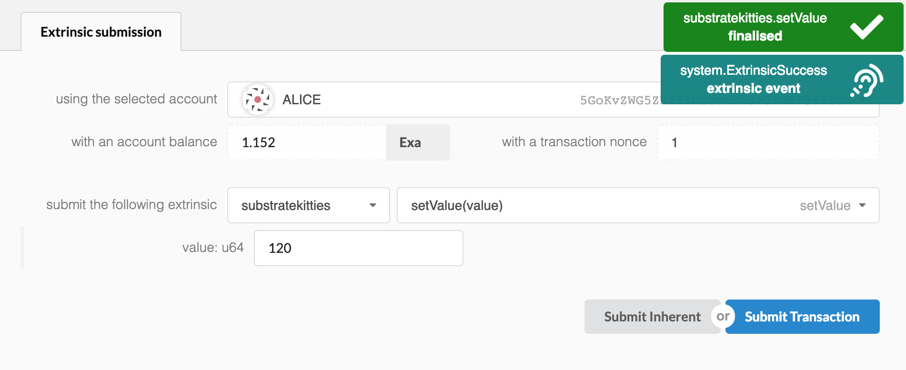
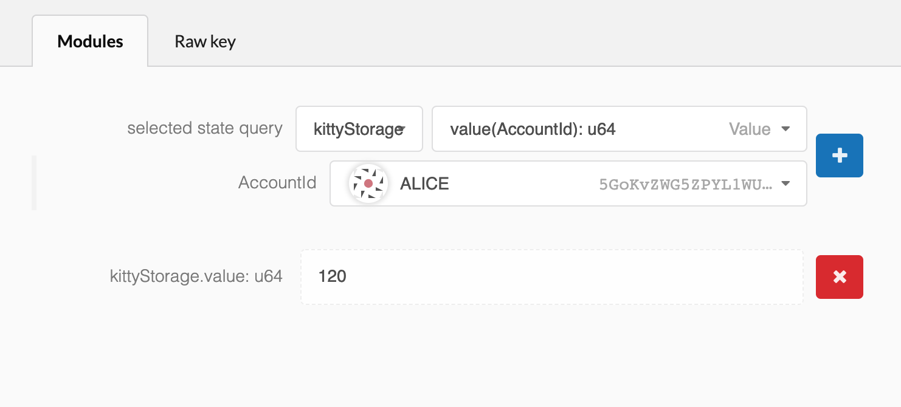

Polkadot UIで今までの作業を確認する
===

そろそろ今までのコードをチェックしてみましょう。間違えがなげれば、エラーなしにコンパイルするはずです。

以下を実行してビルドを行う:

```bash
./build.sh
cargo build --release
./target/release/substratekitties purge-chain --dev
```

ノードを立ち上げましょう:

```bash
./target/release/substratekitties --dev
```

[Polkadot-JS Apps UI](https://polkadot.js.org/apps)に戻ると、ノードがブロックを生成しはじめるはずです。

##トランザクションを送信する

アプリの **Extrinsics** へ行き、 "from extrinsic section" ドロップダウンを使って選択します：

```
substratekitties > setValue(value)
```

値を入力後、`Submit Transaction`を押しましょう：



##ストレージを見る

値をストレージに入力するトランザクションを送信したので、実際に値がそこに保存されているかを確認する必要があります。

アプリの **Chain state** に移動して選択します:

```
kittyStorage > value(AccountId): u64
```

あなたがトランザクションを送信したアカウントを選択し、青い`[+]`ボタンを押すことでストレージにクエリしてください：



あなたが保存したのと同じ値を取得することができるはずです！これを複数のアカウントで試してみると、各ユーザーが自分の値をランタイムストレージに格納できることがわかります。
