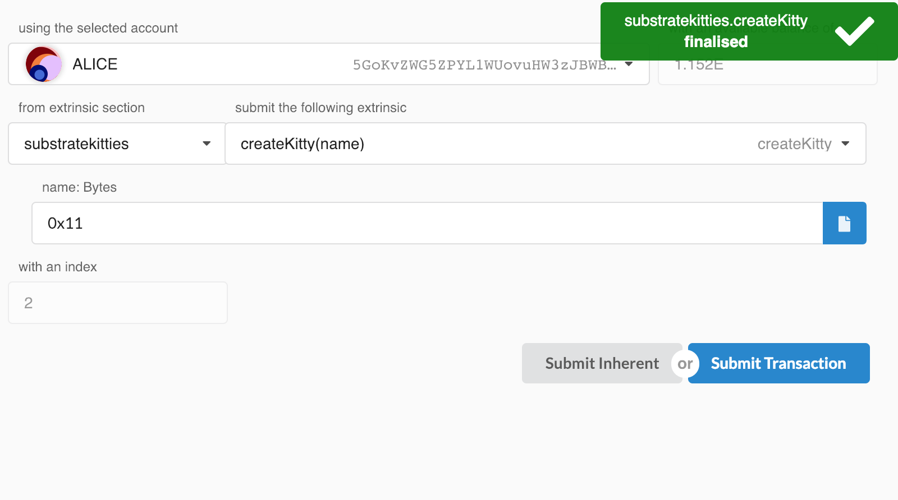
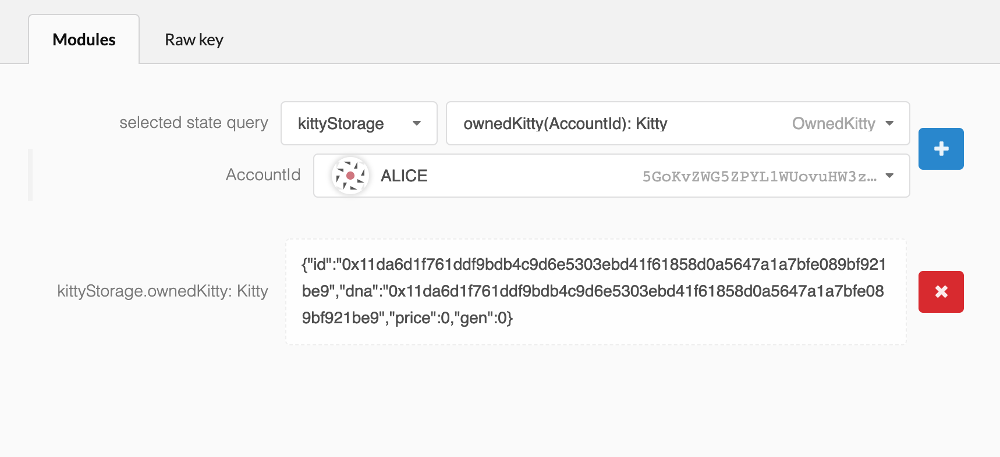

構造体を確認する
===

ここまでで、キティを作るためのランタイムを設定したので、結果を確認します。

前回はカスタム構造をチェーンに導入しました。Polkadot-JS Apps UIは更新を適応するのに非常に優れていますが、この状況では、構造化データをデシリアライズする方法を教えてあげる必要があります。

>注意：ランタイムを更新してノードを立ち上げる時には、チェーンをリセットすることを忘れないでください：
>
> ```
> ./build.sh
> cargo build --release
> ./target/release/substratekitties purge-chain --dev
> ./target/release/substratekitties --dev
> ```

## カスタム構造体を登録する

幸いなことに、Polkadot-JS Apps UIは、ページが情報を正しくデコードできるように、カスタム構造をインポートするための非常に簡単な方法を提供しています。

アプリ上の **Settings** に戻ります。**Developer** セクションでは、カスタム構造を持つJSONファイルを送信するか、コードエディタを通して手動で追加することができます。以下のJSONオブジェクトをコピーしてコードエディタに貼り付け、`Save`を押します。

```
{
    "Kitty": {
        "id": "H256",
        "dna": "H256",
        "price": "Balance",
        "gen": "u64"
    }
}
```

## キティを作る

いよいよ新しいキティを作ることができます。アプリ内の **Extrinsics** で、以下を選択してください：

```
substratekitties > createKitty()
```

Submitを押すと、トランザクションがファイナライズします。



## キティを見る

最後に、保存されているキティオブジェクトを表示して確認するにはアプリの  **Chain State** にアクセスして、以下を選択してください：

```
kittyStorage > ownedKitty(AccountId): Kitty
```

それから`createKitty()`関数を呼び出したユーザを選択してください。これで `Kitty`オブジェクトの個々のプロパティを見ることができるはずです：



---
**発展**

シリアライゼーションとデシリアライゼーションについて

rawバイトを単純に転送および送信する方法

[TODO: make this a page]

---
