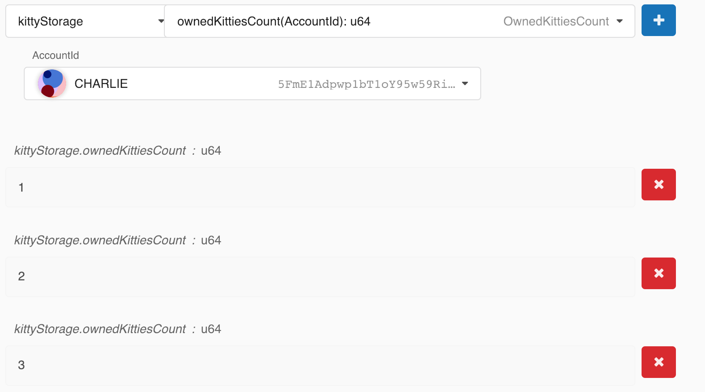
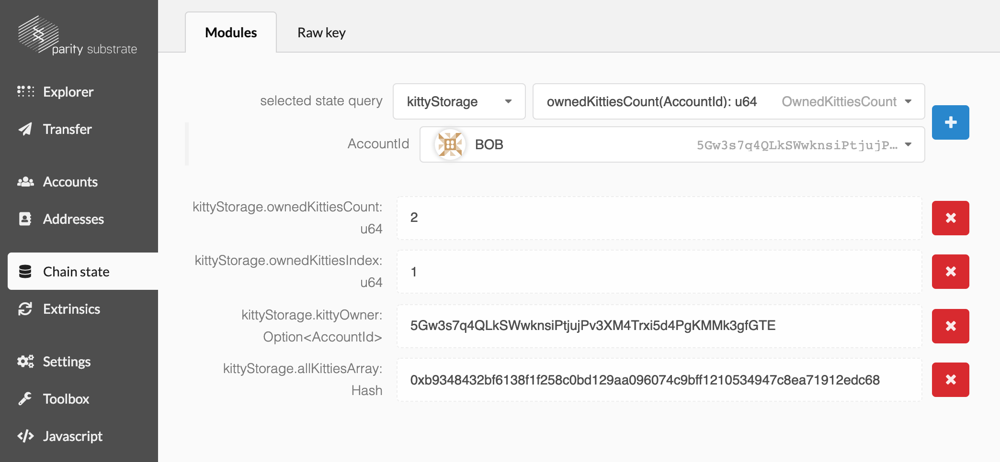

複数のキティを確認する
===

最後にPolkadot UIを動かしてから、ランタイムにストレージやイベントなど沢山追加しました。少し複雑になってきたランタイムを使い、キティをどのように生成できるか、ナビゲートできるかをチェックする良い機会です。

UIに飛び込む前に、あなたのチェーンを初期化することを忘れないでください：

```
./build.sh
cargo build --release
./target/release/substratekitties purge-chain --dev
./target/release/substratekitties --dev
```

## 複数の口座への送金して使用する

あなたがしたい最初のことはAliceが持つ大量の資金を他のアカウントに移すことです。BobとCharlieに資金を送ってみましょう。

アプリを開いて**Extrinsics**タブに行き、`create_kitty()`関数を選択してSubmitします：

```
substratekitties > createKitty()
```

私たちのテストでは、Aliceに３匹のキティ、Bobに2匹、そしてCharlieに1匹作成させます。


## ストレージを確認する

これで、セットアップしたすべてのストレージ項目を調べることにより、キティ作成と保存が正しく行われていることを確認できます。

まず、システム内のキティの総数を確認します：

```
kittyStorage > allKittiesCount(): u64
```

すべてうまくいけば、値(`6`)が返されるはずです。


次に、Aliceに3、Bobに2、Charlieに1が返ることを期待して、各ユーザーのキティ数を確認します。



AllKittiesArrayを見れば、各キティをグローバルインデックスで取得できるはずです。例えば、5番目のキティ（インデックス4）を見て、所有者がボブであることを確認します。さらに、相対的な`OwnedKittiesIndex`が`1`なので、これがボブの2番目の子猫であることも確認できます。



## あなたの番です!

まだ確認していないストレージアイテムがまだいくつかあります。少し時間をかけて脳みそジュースを絞って、すべてが正常に機能することを確認してみてください。エラーが見つかった場合は、ランタイムに戻って問題がどこにあるのかを確認してください。