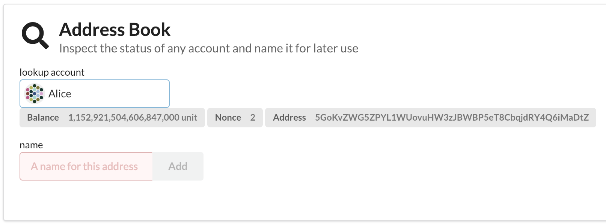
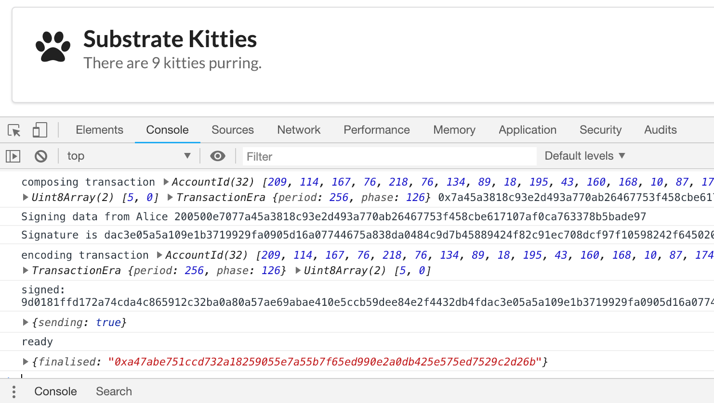

キティを作る
===

UIとRuntimeの連結と実行時ストレージへの感覚が掴めたと思うので、実際に対話をしてみましょう。

## Runtimeを確認する

最後のセクションでは、Substrate UIによって作成された`runtime`変数について調べました。それでは、`calls`変数を見てみましょう:

```
calls.
```


`substratekitties`に入ってみましょう：

```
calls.substratekitties.
```


これは `decl_module！`マクロで作成したすべての関数のリストです。`mint（）`や `_transfer（）`のようなプライベート関数は公開APIではないのでここには表示されないことも確認してください。

## Runtimeをコールする

それでは、新しキティを作成するためにコールをしてみましょう。そのためには、Runtimeに `post（）`リクエストを送る必要があります：

```javascript
post({
    sender: '5GoKvZWG5ZPYL1WUovuHW3zJBWBP5eT8CbqjdRY4Q6iMaDtZ',
    call: calls.substratekitties.createKitty()
}).tie(console.log)
```

このサンプルでは、​​`sender`は私たちのアカウントのうちの一つのアドレスです。Substrate UIの**Address Book**でアカウントのリストを取得することができます。



コンソールでこれを送信すると、バックグラウンドで処理が行われ、その後トランザクションがファイナライズされ、キティの数が増えます。



## トランザクションボタンを作成する

ランタイムを呼び出す方法がわかったので、それをUXに実装します。ここでもまた、`TransactionButton`と`SignerBond`と呼ばれるSubstrate UIによって提供されたコンポーネントを利用します。

ページの他のセクションのコードを見ると、これらの部分を実装する方法の例があります。

`SignerBond`はメッセージに署名したいアカウントの名前のための入力フィールドを作成します。このアカウントは`bond`の中に置かれます。

```javascript
this.account = new Bond;

<SignerBond bond={this.account}/>
```

これで、このbondを`TransactButton`に使用することができます。同じく、bondに保存された値をトランザクションの`sender`フィールドに使います。

```javascript
<TransactButton
    content='Submit Transaction'
    icon='send'
    tx={{
        sender: runtime.indices.tryIndex(this.account),
        call: calls.myModule.myFunction()
    }}
/>
```

`TransactionButton`は`this.account`に依存しているので、`SignerBond`に有効な入力があるまでアクティブにはなりません。それが行われれば、あなたはそのユーザに代わって簡単にトランザクションを送信することができます。

## その他のコンポーネント

Substrate UIを介して利用できる各コンポーネントについては詳しく説明しません。しかし、これらのコンポーネントのほとんどは比較的理解しやすく、自分で再利用できるはずです。

[Reactコンポーネント](https://reactjs.org/docs/react-component.html)で利用できることを以上の`おまじない`はほとんどないので、よりインタラクティブなアプリを作る上で良い学びの場となるでしょう。

## あなたの番です！

あなたのSubstrate UIに `Create Kitty`ボタンを追加しましょう。

`constructor()`の中に新しいbondを作り、そのbondを使って`SignerBond`コンポーネントを動かす必要があります。

それから、`SignerBond`を`TransactionButton`に接続し、`createKitty()`へのコールをします。あなたのトランザクションボタンの見た目を少しマシにするために`paw`アイコンを使うことができます。

これが完了したら、ボタン押して新しいキティの作成テストをします。新しいキティがあなたのシステムに反映された時、"キティカウンター"が増えていることを確認してください。

<!-- tabs:start -->

#### ** Template **

[embedded-code](../../4/assets/4.3-template.js ':include :type=code embed-template')

#### ** Solution **

[embedded-code-final](../../4/assets/4.3-finished-code.js ':include :type=code embed-final')

<!-- tabs:end -->
