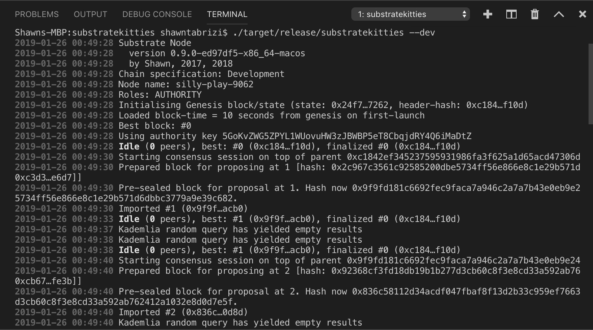

カスタムノードを立ち上げる
===

マシンに環境構築ができたので、事前に用意されたテンプレートを使用してカスタムSubstrateノードをすぐに始められます。

Substrateは急速に発展しているプロジェクトなので、最新版には予期せぬバグが潜んでいるかもしれません。このワークショップでの開発をスムーズに行うために、安定版のSubstrateノードと、それに互換性のあるSubstrate UIを作成します。

このSubstrateパッケージを使う場合、残りのチュートリアルを問題なく完了できるはずですが、そうでない場合はお知らせください。パッケージを入手するには、作業ディレクトリで次のコマンドを実行します。

```bash
git clone --branch v1.0 https://github.com/substrate-developer-hub/substrate-package
```

`substrate-package`レポジトリは以下の二つのフォルダで構成されます：

1. `substrate-node-template`
2. `substrate-ui`

`substrate-ui`フォルダはこのワークショップの第4章までは触れませんが、その名前が示すように、[React](https://reactjs.org/)で書かれた既成のUIが含まれており、後ほど拡張してカスタムできます。

代わりに、`substrate-node-template`フォルダでミニマムな作業用ノードテンプレートを使い、ハックを始めます。

それでは、`substrate-package-rename.sh`スクリプトを使ってプロジェクトとプロジェクトフォルダの名前を変更しましょう：

```bash
./substrate-package-rename.sh substratekitties <あなたの名前>
```

次に、名前が変更された`substratekitties`フォルダに移動し、事前に準備されたノードをビルドします：

```bash
cd substratekitties
./scripts/init.sh
./scripts/build.sh
cargo build --release
```

このプロセスはマシンの性能により時間がかかる場合があるのでコーヒーでも淹れて待ちましょう。ビルド完了したら、ノードを立ち上げます：

```bash
./target/release/substratekitties --dev
```

以上を正しく行えば、ブロックが生成され始めます。



やったね！これであなたの初めてのカスタムノードを走らせることができました！

---
**発展**

`substrate-package`リポジトリは、先ほど実行した` getsubstrate.io`が提供する[いくつかのカスタムコマンド](https://github.com/paritytech/substrate-up)使用して作成されています。

新しいプロジェクトを始めるために最新バージョンのSubstrateを入手したい場合は、次のコマンドを実行して独自のSubstrateパッケージを構築することができます：

```bash
substrate-node-new <project_name> <your_name>
substrate-ui-new <project_name>
```

前述したように、この方法の欠点は、このスクリプトは別のGitHubリポジトリから直接取得することです。つまり、バージョンによっては互換性が失われることがあります。

---
