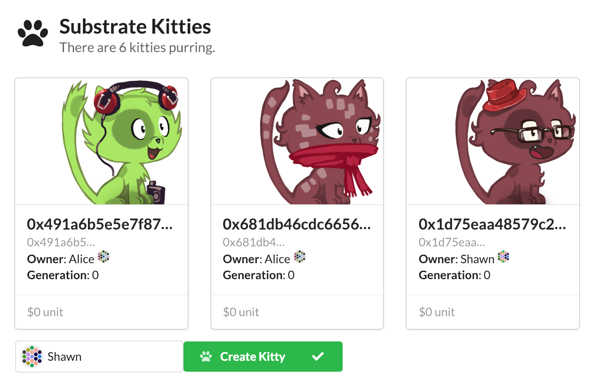

キティをレンダリングする
===

ようやく、このセクションでは今まで数字や文字だったキティに、色や形を与えてあげます。

## 既存の`KittyCard`コンポーネントを追加する

私たちは既にキティを表示するためのカスタムReactコンポーネントを用意しています。それほど複雑ではありませんが、このワークショップの目的に集中するために、ここではこれを使ってください。コンポーネントは`.zip`として[ここから](https://github.com/shawntabrizi/substrate-collectables-workshop/raw/master/4/assets/KittyCards.zip)ダウンロードできます。

ダウンロードできたら、`KittyCards`フォルダをあなたの`src`フォルダに置いてください：

```
substratekitties-ui/
|
+-- src/
    |
    +-- KittyCards/      <-- Place here
    |
    +-- AccountIdBond.jsx
    |
    +-- ...
```

次に、メインの`app.jsx`内でこのコンポーネントをインポートしてください：

```javascript
import { KittyCards } from './KittyCards';
```

すると`<KittyCards>`コンポーネントにアクセスできるようになっています：

```
<KittyCards count={runtime.substratekitties.allKittiesCount} />
```

### `Kitty`タイプを追加する

このコンポーネントが動作する前に、カスタムの`Kitty`タイプについてSubstrate UIに伝える必要があります。 oo7 JavaScriptライブラリが提供する`addCodecTransform()`関数でそれを行うことができます。

私たちのkittyオブジェクトの場合は、このようになります：

```
addCodecTransform('Kitty<Hash,Balance>', {
    id: 'Hash',
    dna: 'Hash',
    price: 'Balance',
    gen: 'u64'
});
```

これをアプリケーションの `constructor()`関数に追加して、起動時に確実に読み込まれるようにすることができます。この後は、他のJSONオブジェクトと同じように `Kitty`オブジェクトの属性とやり取りすることができます。

>注意：Codec変換は、逆シリアル化に使用されるべきオブジェクト構造を検索するためにキー/値ペアを使用します。結果として、あなたの "オブジェクト名"が正確に予想されるものと一致することが重要です。この場合、オブジェクト名 `Kitty <Hash、Balance>`にスペースがないことに注意してください。サブストレートUIがカスタムオブジェクトの正しいキーを見つけられない場合は、ブラウザコンソールに予期しているとおりの正確なオブジェクト名が表示され、エラーが発生します。

## カスタムコンポーネント内を覗く

このコンポーネントを作成することはありませんので、代わりにいくつかの動作部分を紹介します:



### 動的カードローディング

システムにキティが追加されたときにどのようにして動的に新しいカードをロードすることができるかを示すために`/KittyCards/index.jsx`の部分を簡単に見ていきましょう。

UIから `KittyCard`コンポーネントを以下のように呼び出します：

```
<KittyCards count={runtime.substratekitties.allKittiesCount} />
```

このコンポーネントは `allKittiesCount`bondに結び付けられています。これはブロックチェーンの状態が変わると自動的に更新されます。

`allKittiesCount`が変更されると、`KittyCards`コンポーネントの `readyRender（）`部分が発動して最新のカウントを取得し、`allKittiesArray()`の各項目をループ処理してユニークなキティID`Hash`を返します。

```javascript
    readyRender() {
        let kitties = [];

        for (var i=0; i < this.state.count; i++){
            kitties.push(
                <div className="column" key={i}>
                    <KittyWrap hash={runtime.substratekitties.allKittiesArray(i)} />
                </div>
            );
        }
```

これはその後、キティID`Hash`を`KittyWrap`コンポーネントに送ります。`KittyWrap`コンポーネントは`owner`と `Kitty`オブジェクトの単純な検索を行います。`KittyWrap`に送られた`hash`がループ間で変わらなければ、Reactは単にレンダリング処理をスキップします。

```javascript
class KittyWrap extends ReactiveComponent {
    constructor(props) {
        super(['hash']);
    }

    readyRender() {
        const { hash } = this.state; // Object destructuring assignment syntax

        return (
            <KittyCard
                kitty={runtime.substratekitties.kitties(hash)}
                owner={runtime.substratekitties.kittyOwner(hash)}
            />
        );
    }
}
```

最後に、`KittyWrap`は実際に各カードの内容を生成する`KittyCard`を呼び出します。

JavaScript [Object Destructuring Assignment Syntax](https://developer.mozilla.org/en-US/docs/Web/JavaScript/Reference/Operators/Destructuring_assignment#Object_destructuring)を使用して`this.state`から`hash`プロパティを展開していることに注意してください。
（この値を複数回再利用しているので、this.state.hashを繰り返し書く必要はない）

### カードの内容

私たちの`KittyCard`コンポーネントは`KittyWrap`から渡された `Kitty`オブジェクトとその所有者を受け取り、すべてのデータをフォーマットします。上から下の順：

 - キティID
 - キティDNA（これはgen 0であるキティにも同じ）
 - キティ所有者
 - キティジェネレーション
 - キティ価格

```javascript
<Card>
    <KittyAvatar dna={kitty.dna} />
    <Card.Content>
        <Card.Header>
            <Pretty
                value={kitty.id}
                className='limit-name'
            />
        </Card.Header>
        <Card.Meta>
            <Pretty
                value={kitty.dna}
                className='limit-dna'
            />
        </Card.Meta>
        <Rspan>
            <b>Owner</b>: {
                secretStore()
                    .find(this.state.owner)
                    .name
            }
        </Rspan>
        &nbsp;
        <Identicon
            key={this.state.owner}
            account={this.state.owner}
            size={16}
        />
        <br />
        <Rspan>
            <b>Generation</b>: {kitty.gen}
        </Rspan>
        <br />
    </Card.Content>
    <Card.Content extra>
        <Pretty
            value={kitty.price}
            prefix="$"
        />
    </Card.Content>
</Card>;
```

最後のレンダリングを行うために、bondsや他のサブストレートUIコンポーネントを使用しているのがわかります。

### DNAからキティを生成する

私たちの `KittyCard`は`<KittyAvatar>`コンポーネントの中にもう一つの抽象化層を持っていることがみて取れます。

`/KittyCards/avatars/index.jsx`を見ると、キティ画像の生成を管理する最後のReactコンポーネントが確認できます。

コンポーネントの中心的な機能は`dnaToAttributes()`です:

```
function dnaToAttributes(dna) {
    let attribute = (index, options) => dna[index] % options;

    return {
        body: IMAGES.body[attribute(0, 15)],
        eyes: IMAGES.eyes[attribute(1, 15)],
        accessory: IMAGES.accessories[attribute(2, 20)],
        fur: IMAGES.fur[attribute(3, 10)],
        mouth: IMAGES.mouth[attribute(4, 10)]
    };
}
```

キティDNAはバイト（0〜256）の配列であり、最初の5バイトをキティ用に選択された特定の属性を制御するためにマップします。属性ごとに256個の設定可能な値を設定できることだけでなく、最大256個の属性を設定することもできます。

David Revoyによる[Cat Avatar Generator](https://framagit.org/Deevad/cat-avatar-generator/tree/master)プロジェクトを使用して画像に命を与えました。

## 演習してみよう！

`KittyCard`コンポーネントがどのように機能するのか理解できたので、それをあなたのSubstrate UIに実装しましょう。

完了したら、キティを作成してUIの更新を確認してください。Polkadot UIの別のタブでトランザクションを開始して、他のランタイム機能を試すこともできます。

React + JavaScript + Bondsの機能をテストしたいですか？私達はランタイムに1つしか機能を実装していませんが、想像力を働かせて自分だけのアプリを作ってみてください！これは簡単な例です：

 - キティの価格設定
 - キティを買う
 - 特定の所有者だけにキティを見せる
 - キティの交配
 - などなど

ランタイムからキティを削除する方法を紹介するなら`KittyCards`コンポーネントをどのように変更するかも考える必要があります。


>### SubstrateKittiesワークショップの終了おめでとうございます。ここまでワークショップを進めてくださったなら、Substrateを使ったRuntime開発の基礎を学んでいただけたことと思います。しかしこれはSubstrateのごく一部でしかなく、まだ使っていないSRMLやSubstrate Coreの機能を使うことで様々なブロックチェーンの可能性を考えることができます。
>### また、Substrateで作ったチェーンはParachainとしてPolkadot上で他のチェーンと相互互換性を持って、メッセージ/価値/アイデンティティを交換することが可能になります。Polkadotについてもっと深く学びたい方や、将来、Parachainとしてデプロイをしてみたい方は日本語で書かれた「[初心者のためのPolkadot](https://link.medium.com/EXHDwcrXQV)」で全体像を掴み、提供されているリソースを活用することができます。
>### 翻訳者：[Masaki Minamide](https://twitter.com/masakiminamide)より


<!-- tabs:start -->

#### ** テンプレート **

[embedded-code](../../4/assets/4.4-template.js ':include :type=code embed-template')

#### ** 解答 **

[embedded-code-final](../../4/assets/4.4-finished-code.js ':include :type=code embed-final')

<!-- tabs:end -->
