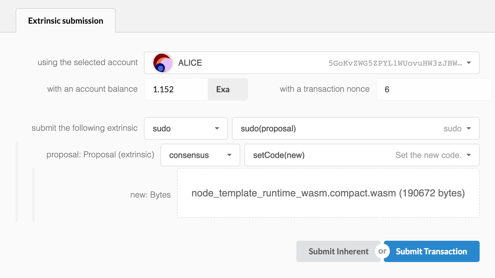
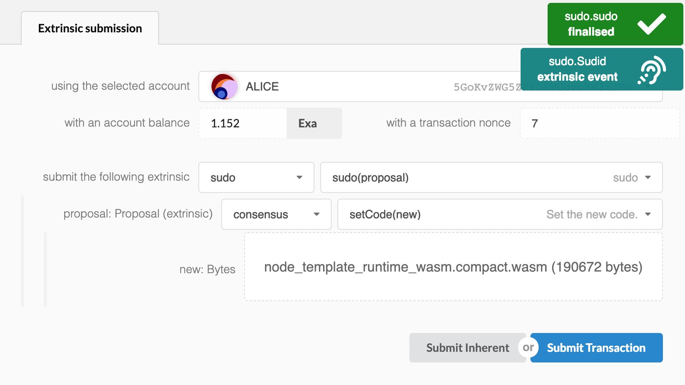
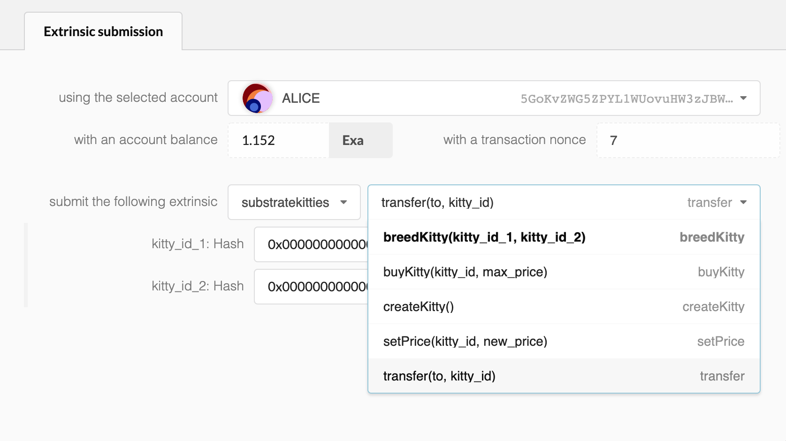

# 培育一只 Kitty

原始 CryptoKitties 游戏中最独特的部分可能是从现有 kitty 中培育出新的 kitty。

我们已经准备好了我们的 `Kitty` 对象，引入了将用于形成全新的 kitty 后代的 `dna` 和 `gen`。

## 遗传特征

在我们的 UI 中，我们将使用 kitty DNA 生成我们的 kitties 图像。在我们的 runtime 中，DNA 是 256 位的 hash 值，在我们的代码中用 bytearray 表示，在我们即将实现的 UI 中用十六进制字符串表示。

这意味着有 32 个元素，每个元素可以是 0 到 255 之间的值。我们将使用这些元素来确定我们的 kitty 有哪些特征。例如，byte array 的第一个索引可以确定 kitty 的颜色（从256种颜色的范围）;下一个元素可以代表眼睛形状等...

```
Attribute:  Color Eyes Hair Collar Accessory
DNA:        [233] [15] [166] [113] [67] ...
```

当我们培育两只 kitty 时，我们希望后代的属性有一些来自父母的遗传。我们将为我们的游戏做的是随机选择一位父母将其属性赋予孩子。

```
Kitty1 DNA:   [212] [163] [106] [250] [251] [  0] [ 75]...
                |     |                       |
Child DNA:    [212] [163] [ 69] [195] [223] [  0] [201]
                            |     |     |           |
Kitty2 DNA:   [233] [ 49] [ 69] [195] [223] [133] [201]...
```

我们在模板中为你提供基因拼接算法，但你可以随意进行修改。

## 链的升级 (可选的)

Substrate 的一个很酷的功能是能够进行无分叉的实时链升级，这可以为区块链引入新特性和功能，而不会破坏现有节点。

我们将向你展示如何仅使用 Wasm runtime 来升级你的链，而不是清除你的链并重建原生二进制文件以引入 `breed_kitty()` 函数。

保持上一节的节点一直运行，并在新的终端中运行：

```bash
./build.sh
```

这将在以下路径中生成一个新的紧凑的 Wasm 二进制文件：

```bash
./runtime/wasm/target/wasm32-unknown-unknown/release/node_template_runtime_wasm.compact.wasm
```

我们现在可以在 Polkadot UI 中使用此文件来升级你的链。转到 Polkadot UI 的 **Extrinsics** 部分，然后选择：

```
submit the following extrinsic: sudo > sudo(proposal)
    proposal: Proposal (extrinsic): consensus > setCode(new)
```



然后使用 `compact.wasm` 文件作为此次调用的输入。确保执行此函数， 因为在 genesis 配置中设置的 **Alice** 是允许进行 `Sudo` 调用的 `admin`。

按下 **Submit Transaction** 创建一个块后，你应该可以看到一个显示合同升级成功的 `Sudid` event！



最后，如果我们刷新页面并查看 Substratekitties module 中可用的 extrinsics，我们会发现现在出现了 `breedKitty()` 函数。



如果你在升级之前有任何已保存状态（例如 Kitties，balances 等等），你将看到在 runtime 升级后此状态仍然被保留。此时，你的区块链通过 Substrate 提供的 Wasm 解释器运行 runtime 的 Wasm 版本。此 runtime 存在于区块链中，这意味着它会同步到运行链的所有节点，从而使你的网络保持彼此同步。在解释器中运行 Wasm 比运行原生代码慢，因此你总是可以通过命令 `cargo build --release` 来编译一个新的可执行文件来完成完整的节点升级并重启节点。

## 轮到你了！

你将发现在第 2 章中我们重构的 `mint()` 函数将对我们的最后一步有很大帮助。使用基因拼接算法在两个输入的 kitties 上生成一个新的 kitty。

确保新 kitty 增加的 `gen` 值只比父母 kitties 的最大值大一。通过这种方式，我们可以追踪那些从一开始培育的 kitties。

然后将该 kitty 对象传递给 `mint()` 函数以创建新的 kitty！

最后，如果你够勇敢的话，请进行实时 runtime 升级，从而将此新功能添加到区块链中。你会发现所有现有存储项都不受升级的影响，现在你可以访问这个新功能了！

<!-- tabs:start -->

#### ** Template **

[embedded-code](../../3/assets/3.4-template.rs ':include :type=code embed-template')

#### ** Solution **

[embedded-code-final](../../3/assets/3.4-finished-code.rs ':include :type=code embed-final')

<!-- tabs:end -->
